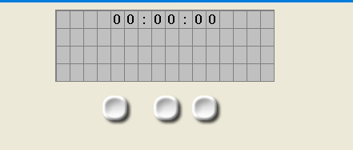

# Stoperica

Digitalna stoperica izrađena u Flowcode-u koristeci 4x20 LCD display i 3 tastera.

Funkcije:
- START pokretanje vremena
- STOP zaustavljanje štoperice
- RESET vracanje vremena na 00:00:00

Vrijeme se prikazuje na LCD displayu u minutama, sekundama i stotinkama.
## Screenshot

Prikaz izgleda stoperice.

## Tehnologije
- Flowcode
- LCD 4x20
- Tasteri (3 buttona)
- PIC mikrokontroler

## Autor
Tarik Memic
